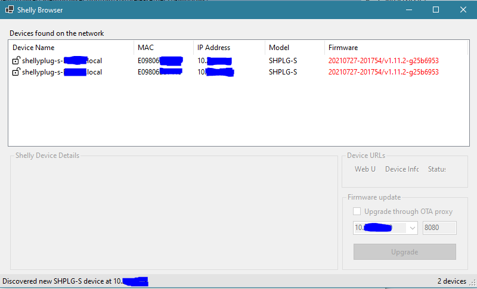

# Shelly Browser

**WARNING - work in progress**

Shelly Browser is a C# .NET (Core) application for Windows, to detect, view and upgrade Shelly (v1) devices.

Devices are detected via mDNS advertisements and details are loaded using the on-device APIs. Upgrades are currently done by invoking the /ota device API,
later I'm planning to implement a proxy solution identical to the one used in my shelly-ota project.

This is a side-project for me to learn about C# and .NET in general, and is the first Windows/GUI application I developed so
there are probably lots of bugs, inefficiencies and silly solutions used. Suggestions are welcome.
